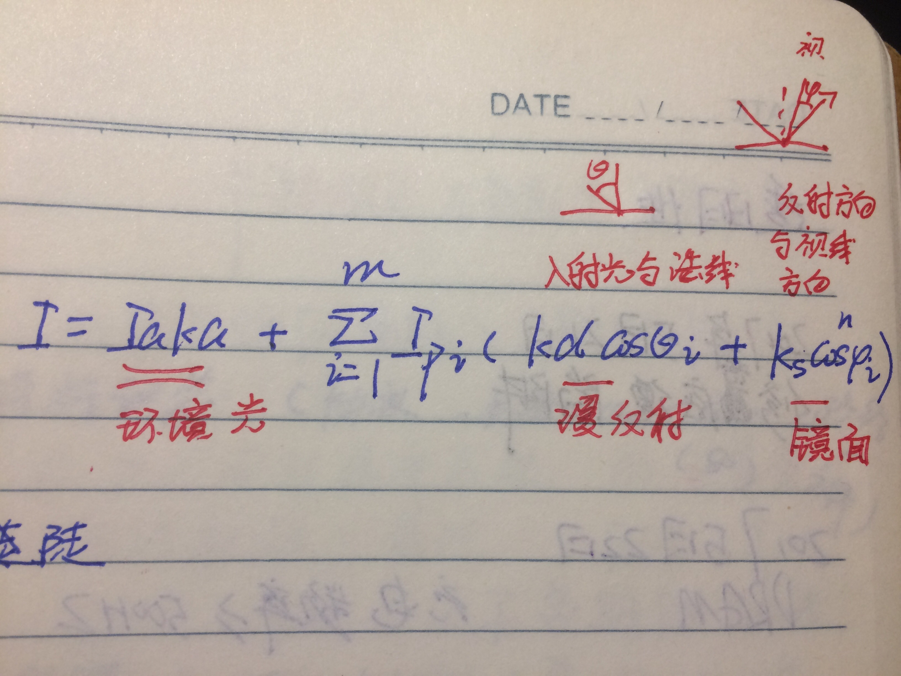

# 图形学笔记

## 曲线与曲面

### 插值与拟合

概念：给定n个点$$(x_1,y_1)....(x_n,y_n)$$,求m次代数多项式$$P_m(x)=x_0+x_1x...+xmx^m$$(m<n)作原函数$$f(x)$$的近似拟合满足$$R=\sum_{i=1}^{n}[y_i-P_m(x_i)]^2$$最小化.则$$P_m(x)$$叫$$f(x)$$的m次拟合多项式。当$$m=n-1,R=0$$;此时$$P_m(x)称为$$f(x)$$的插值多项式(重建函数).

````matlab
x=0 : .1 : 1;
y=[-.447 1.978 3.28 6.18 7.02 7.32 7.88 9.56 9.56 9.30 11.2];
n=2;
p=polyfit(x,y,n);
xi=linspace(0,1,100);
yi=polyval(p,xi);
plot(x,y,'o',xi,yi);
xlabel('x'),ylabel('y=f(x)');
````
**三次样条插值**

概念:三次样条曲线是由多段三次多项式曲线光滑拼接而成。各段多项式一般是不同的，相邻段之间端点处的一阶导数与二阶导数相同。

函数：spline()

**Hermite曲线**

概念:       已知端点以及端点处切向量求得的三次多项式曲线称为Hermite插值曲线，也叫做Ferguson曲线。

**贝塞尔曲线**

贝塞尔曲线的几何性质
       贝塞尔曲线是一种磨光曲线，可以通过割掉特征多边形顶角得到，具有一些重要特性，例如如下几个性质：
       贝塞尔曲线的起点就是第一个控制点，曲线终点是最后一个控制点。
       顺次连接控制点形成的多边形称为贝塞尔曲线的特征多边形。贝塞尔曲线起点处切线与终点处切线分别是特征多边形的第一条边和最后一条边所在射线，并且切失的模长分别为相应边长的n倍。
       对区间[0, 1]的任意值t，点(x(t),y(t))一定落在特征多边形形成的凸包内。

$$P(t)=\begin{bmatrix}t^3 &t^2& t& 1\end{bmatrix}\begin{bmatrix}-1&3&-3&1\\3&-6&3&0\\-3&3&0&0\\1&0&0&0\end{bmatrix}\begin{bmatrix}P_0\\P_1\\P2\\P3\end{bmatrix}$$


**B样条曲线**

$$P(t)=\frac{1}{6}\begin{bmatrix}t^3 &t^2& t& 1\end{bmatrix}\begin{bmatrix}-1&3&-3&1\\3&-6&3&0\\-3&0&3&0\\1&4&1&0\end{bmatrix}\begin{bmatrix}P_0\\P_1\\P2\\P3\end{bmatrix}$$

**曲线拼接**

关键:拼接处值以及一阶导相等.

对于三次贝塞尔曲线:$$P_3,P_4,P_5$$共线则可以在$$P_4$$处光滑连接.

对于二次B样条曲线:曲线１($$P_1,P_2,P_3$$)，曲线２($$P_2,P_3,P_4$$)光滑拼接.

**双三次贝塞尔曲面**

$$P(u,v)=\begin{bmatrix}u^3&u^2&u&1\end{bmatrix}\begin{bmatrix}-1&3&-3&1\\3&-6&3&0\\-3&3&0&0\\1&0&0&0\end{bmatrix}\begin{bmatrix}P_{00}&P_{01}&P_{02}&P_{03}\\P_{10}&P_{11}&P_{12}&P_{13}\\P_{20}&P_{21}&P_{22}&P_{23}\\P_{30}&P{31}&P_{32}&P_{33}\end{bmatrix}\begin{bmatrix}-1&3&-3&1\\3&-6&3&0\\-3&3&0&0\\1&0&0&0\end{bmatrix}\begin{bmatrix}v^3\\v^2\\^v\\1\end{bmatrix}$$

**双三次Ｂ样条曲面**

$$P(u,v)=\frac{1}{6}\begin{bmatrix}u^3&u^2&u&1\end{bmatrix}\begin{bmatrix}-1&3&-3&1\\3&-6&3&0\\-3&0&3&0\\1&4&1&0\end{bmatrix}\begin{bmatrix}P_{00}&P_{01}&P_{02}&P_{03}\\P_{10}&P_{11}&P_{12}&P_{13}\\P_{20}&P_{21}&P_{22}&P_{23}\\P_{30}&P{31}&P_{32}&P_{33}\end{bmatrix}\begin{bmatrix}-1&3&-3&1\\3&-6&3&0\\-3&0&3&0\\1&4&1&0\end{bmatrix}\begin{bmatrix}v^3\\v^2\\^v\\1\end{bmatrix}$$

**曲面拼接**

双三次贝塞尔曲面光滑拼接*充要条件*：１２个公共控制定点

双三次Ｂ样条曲面*必要条件*：4个公共控制定点

**龙格现象**

高次插值多项式改为分段低次

## 几何造型

**几何造型的三种模型**
    线框模型
    表面模型
    实体模型

*线框(wireframe)模型*是用顶点与邻边表示形体的一种模型。线框模型是计算机图形学领域最早用来表示形体的模型，目前也被广泛使用。这种表示方法结构简单、易于理解，又是表面和实体模型的基础。

*表面(surface)模型*是用棱边围成的部分来定义形体表面，由面的集合来定义形体。表面模型是在线框模型的基础上，增加了有关面边的信息以及表面特征等。 

可以用下面的描述作为*实体模型*的定义：
    1、能生成立体图形，能明确的定义立体图形的内外部。
    2、可以提供清晰的剖面图。
    3、方便图形存储、变换、显示等。


**实体模型构造方法**

    边界表示法 
    分解表示法 
    扫描造型法 

*边界表示（B-rep）法*是在表面模型的基础上改进的。该方法以物体边界为主干，以表面模型为基础。因为要构造完整的实体，所以表面必须封闭、有向、不自交、有限和互相连接等。在这种表示方法中，既包含几何信息，又包含有拓扑信息。几何信息标示形体的大小，拓扑信息标示顶点、棱边以及表面之间的相互连接关系。

*分解表示法*是使用小的实体块堆积起来表示实体。分解表示法主要有：（四叉树）八叉树表示法、细胞分解法、空间堆叠法等。

*扫描造型法*的基本思想是：让一个形体在空间中运动，产生了由这个形体构成的集合，这个集合就是一个新的几何体。简单的扫描形式有两种，即平移和旋转。

##隐藏面处理与光照效果

**平行投影与透视透视投影**

正平行投影也叫正交投影可以保持物体实际大小,透视投影可以得到真实感图像。

**隐藏面计算方法**

*背面检测法*:    在几何造型一章中，实体模型边界表示法为每个面规定了一个正方向，定义垂直于该面并且*背离*物体的方向为该面的正方向。对于单个凸多面体，可以按如下步骤计算不可见面。求一个面所在平面的法向量n；求这个平面的视线向量ｖ；计算视线向量与法向量的数量积；根据n与ｖ数量积的符号判断该面是否被遮挡，符号为正，被遮挡；符号为负，没有被遮挡。

*深度缓冲器消隐算法*

    初始化二维数组A（用来存储颜色），屏幕上的点的位置作为数组下标，数组中的值设为背景 色；初始化二维数组Z（用来存储深度），屏幕上的点的位置作为数组下标，数组中的值设置成为0；

````c
for(各个多边形)
	   {
	      把该多边形投影到视平面（屏幕）上；
	      for (多边形所覆盖的每个像素点(x,y))        
	          {
	           计算多边形在该像素的深度值Z(x,y);
	           if (Z(x,y)大于数组Z在这个位置上原有的值)
	               {
		    把Z(x,y)存入数组Z，替换该位置原先的值
	                把多边形在(x,y)处的颜色值存入数组A；
	                }
	          }
	    }
````

*画家方法*:这种方法按照多边形离观察者的远近建立一张深度优先级表，距离观察者近的优先级高。如果空间中各个多边形都可以区分出远近，那么，先把最远处的多边形绘制在屏幕上，然后从远到近绘制其他多边形。如果投影区域重叠，便使用近处的多边形颜色覆盖先绘制的远处的多边形。

*区域细分（Warnock）算法、扫描线算法*等等

**光照效果**

*简单光照模型*: 为建模后的物体添加光照效果，最好的办法是对物体可见面上的每一点都添加亮度与颜色。但是，这种方法工作量大，不易实现，所以，要充分利用物体的形状与连接信息添加光照效果。


*Phong光照模型*:


明暗插值方法

*哥罗德（Gouraud）强度插值法*
    哥罗德插值方法首先计算多面体每个面的法向量，然后计算一个顶点周围各个面法向量的平均值（求向量和，然后除以面的个数）。把这个平均向量量作为该顶点的法向。
    按如此方法，求出每个顶点的法向量。
    根据法向量，计算出每个顶点的亮度。
    根据顶点的亮度，用插值方法计算每个边上各点的亮度。
    根据边上各点的亮度，用插值方法计算区域内各点的亮度。

*冯（Phong）法向插值法*
    该方法首先计算多面体每个面的法向量，然后计算一个顶点周围各个面的法向量平均值（求向量和，然后除以面的个数），把这个平均向量作为该顶点的法向量。如此求出每个顶点的法向量。这个过程与哥罗德插值方法是相同的。
    根据顶点法向量，用插值方法求出每个边上各点的法向量。
    根据边上各点法向量，用插值方法求出每个面上各点的法向量。
    根据面上各个点的法向量，结合视点方向，计算每点的亮度。
    这种方法因为是计算向量的插值，所以计算复杂性要高于哥罗德插值方法，但是这种方法的效果要好于哥罗德插值方法。

阴影生成方法

*自身阴影生成方法*
    首先，计算自身阴影区域，把光源看作视点，使用隐藏面检测算法，得到光源照射不到的区域。该区域即为阴影区域。
    然后，根据视点位置计算可视面。
    最后，求光源照射不到的区域与可视区域的交集，交集所表示的区域就是自身阴影区域，在该区域绘制上阴影颜色。

*投射阴影生成方法*
    首先，从视点出发，向阴影投射面发出一条射线，若中间没有物体遮挡，那么射线与阴影投射面有一个交点。
    然后，连接交点与光源，如果该交点与场景中物体相交，那么该点就是阴影区域的一点。否则，该点不在阴影区域。


透明性

$$I=(1-t)I_C+tI_t$$        $$0\leq t \leq1$$式中，t=0时对应不透明面，t=1时为透明面，t也称为透明度。

整体光照模型

$$I=I_1+I_sk_s+I_tK_t$$

$$I_1$$光源直接照射引起的反射光亮度，用Phong简单光照模型计算；


##虚拟现实

*虚拟现实（Virtual Reality）*是一种技术，这种技术可以应用于虚拟测试、虚拟游览、网上购物、游戏制作等许多领域。虚拟现实也可以定义为：使用计算机图形学相关技术制作的软硬设备结合在一起的一个可交互操作的虚拟系统。

虚拟现实系统具备以下特性：
（1）能够提供三维的虚拟世界，使用者是在虚拟世界场景中自由虚拟活动的主体；
（2）使用者能够通过软件或硬件设备操纵或改变这个虚拟世界，就象真的置身于这个场景之中。

VRML介绍

*VRML*的全称是Virtual Reality Modeling Language，是一种图形设计程序语言的国际标准，其规范由国际标准化组织(ISO)定义。

V-Realm Builder

*V-Realm Builder*是商业化的优秀VRML编辑器，是由Ligo公司开发。是一个构造三维虚拟世界的软件（工具包），它生成的三维物体和虚拟世界可以用支持VRML的浏览器来观察。

V-Realm Builder2常用节点的使用
    几何造型节点(几何体，Text)
    Translation组节点
    质感与质材节点（1）质感节点Material:。(2)质材节点:ImageTexture、Moivetexture以及PiexlTexture
    光源节点:DirectionalLight、PointLight和SpotLight(探照光源)

复杂几何体造型节点　    
    网格造型节点与万能几何节点
    拉伸造型节点
    万能几何节点

##不规则物体建模

*分形技术*

在图形学中，一般把*分形定义*为具有自相似特性的图形点集。

*迭代函数系统*简记为IFS，是英文Iterated Function Systems的缩写。线性迭代函数系统的每个迭代函数表达式都是线性的，所以称为线性迭代表达式。


*基于图像的图形绘制*

*非真实感图形绘制技术*：物体的不规则变换是非真实感图形绘制的一个主要技术手段，例如，二次变换、三次变换与三角变换等。


